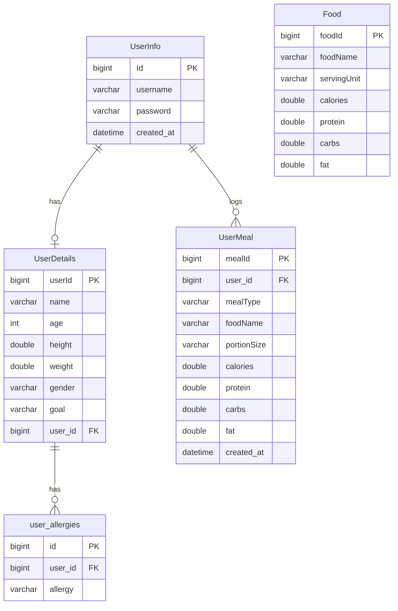

<div align="center">

# NutriScan

### AI-Powered Nutrition Tracking & Health Analysis Platform

An AI-powered nutrition tracking and health analysis web application that helps users monitor their diet, analyze nutritional intake, and receive personalized health recommendations.

[](https://www.java.com/)
[](https://spring.io/projects/spring-boot)
[](https://supabase.com/)
[](https://jwt.io/)
[](https://vercel.com/)
[](https://railway.app/)
[](https://ai.google.dev/)
[](#-license)

</div>

---

## Table of Contents

- [About the Project](#-about-the-project)
- [Tech Stack](#-tech-stack)
- [Main Features](#-main-features)
- [Application Workflow](#-application-workflow)
- [System Architecture](#-system-architecture)
- [Database Design (ER Diagram)](#-database-design-er-diagram)
- [Project Structure](#-project-structure)
- [API Endpoints](#-api-endpoints)
- [Installation](#-installation)
- [Screenshots](#-screenshots)
- [Future Enhancements](#-future-enhancements)
- [Contributing](#-contributing)
- [License](#-license)

---

## About the Project

**NutriScan** is a full-stack nutrition tracking application that combines a **Spring Boot** REST API backend with a lightweight **HTML/CSS/JavaScript** frontend to help users take control of their health. Users can log meals, track macronutrients and water intake, scan barcodes, and even snap a photo of their food to have it automatically identified and logged — powered by **Google's Gemini API** and the **USDA FoodData Central** database.

The platform is built with a strong focus on **security** (JWT-based authentication), **data accuracy** (local caching + USDA lookups), and **actionable insights** (dashboard analytics and AI-generated health suggestions).

---

## 🛠 Tech Stack

<table>
<tr>
<td valign="top" width="25%">

**Frontend**
- HTML5
- Tailwind CSS
- JavaScript

</td>
<td valign="top" width="25%">

**Backend**
- Java
- Spring Boot
- Spring Security
- JWT Authentication
- Maven

</td>
<td valign="top" width="25%">

**Database**
- PostgreSQL
- Supabase

</td>
<td valign="top" width="25%">

**External APIs**
- Gemini API (AI food recognition & suggestions)
- USDA FoodData Central API

</td>
</tr>
</table>

**Deployment:**

| Layer | Platform |
|---|---|
| Frontend | [Vercel](https://vercel.com/) |
| Backend | [Railway](https://railway.app/) |
| Database | [Supabase](https://supabase.com/) |

---

## Main Features

-  User Registration & Login
-  JWT Authentication
-  User Profile Management
-  BMI Calculation
-  Daily Meal Logging
-  Nutrition Tracking
-  Dashboard Analytics
-  Personalized Health Suggestions
-  USDA Food Search
-  AI-Powered Food Image Detection
-  Barcode Scanning
-  Responsive Design

---

##  Application Workflow

<details>
<summary><b>1) Onboarding & Profile Flow</b></summary>

```text
User
  │
  ▼
Register / Login
  │
  ▼
Complete Profile
  │
  ▼
Calculate BMI
```

</details>

<details>
<summary><b>2) Manual Food Search & Meal Logging Flow</b></summary>

```text
Search Food
  │
  ├── Check local Food table
  │
  ├── Found
  │      │
  │      ▼
  │   Return nutrition data
  │
  └── Not Found
         │
         ▼
  USDA FoodData Central API
         │
         ▼
  Store food in local database
         │
         ▼
     Add Meal
         │
         ▼
Dashboard & Analytics Updated
```

</details>

<details>
<summary><b>3️) AI Image Recognition Flow</b></summary>

```text
Upload Food Image
        │
        ▼
     Gemini API
        │
        ▼
  Identify Food Name
        │
        ▼
Search Local Food Database
        │
        ├── Found → Return Nutrition
        │
        └── Not Found
                │
                ▼
        USDA FoodData Central API
                │
                ▼
        Save Food Locally
                │
                ▼
             Add Meal
```

</details>

**In summary:**

1. User registers or logs in.
2. User completes their profile.
3. BMI is calculated automatically.
4. User logs a meal — either via manual search, barcode scan, or food image upload.
5. The backend checks the local `Food` table first, falling back to the USDA FoodData Central API if the item isn't cached.
6. Nutritional values are stored in PostgreSQL.
7. Dashboard analytics are recalculated in real time.
8. For image-based logging, the Gemini API identifies the food and hands off to the same lookup pipeline; barcode scans use a dedicated lookup service.
9. The dashboard displays updated insights and personalized health suggestions.

---

## System Architecture

<p align="center">
  
</p>

The system follows a clean, layered architecture: a static **frontend** (hosted on Vercel) communicates with a **Spring Boot backend** (hosted on Railway) over a REST API. The backend groups its services into authentication/user-management and meal/analytics/AI logic, integrates with **external APIs** (Gemini, USDA FoodData Central, Barcode Lookup), and persists all data in **PostgreSQL** (hosted on Supabase).

---

## Database Design (ER Diagram)



> The `Food` table acts as a **local cache** — populated on-demand from the USDA FoodData Central API — so repeated lookups for the same food are fast and don't hit external rate limits.

---

## Project Structure

```
NutriScan/
├── frontend/
│   ├── assets/
│   ├── index.html
│   ├── dashboard.html
│   ├── css/
│   └── js/
│
└── backend/
    └── src/main/java/com/nutriscan/
        ├── controller/      # REST controllers (Auth, Meal, Dashboard, etc.)
        ├── service/         # Business logic layer
        ├── repository/      # Spring Data JPA repositories
        ├── model/           # Entity classes (UserInfo, UserDetails, Food, UserMeal...)
        ├── security/        # JWT filters, Spring Security config
        ├── dto/             # Request/response data transfer objects
        └── config/          # App-wide configuration (CORS, beans, etc.)
```

---

## API Endpoints

| Method | Endpoint | Description |
|--------|----------|-------------|
| **POST** | `/auth/register` | Register a new user |
| **POST** | `/auth/login` | Authenticate user and return JWT token |
| **POST** | `/preferences` | Save user profile, goals, allergies, and preferences |
| **PUT** | `/updatePreferences` | Update user profile information |
| **GET** | `/profile` | Retrieve user profile details |
| **GET** | `/bmi` | Calculate and return user's BMI |
| **POST** | `/addMeal` | Add a meal entry with nutritional information |
| **GET** | `/todayMeal` | Retrieve today's logged meals |
| **GET** | `/meals/history` | Retrieve meal history by date and meal type |
| **DELETE** | `/deleteMeal/{mealId}` | Delete a meal entry |
| **GET** | `/dashboard` | Retrieve dashboard summary (calories, macros, water, etc.) |
| **GET** | `/analytics` | Retrieve nutrition analytics and trends |
| **POST** | `/identify` | Identify food from an uploaded image using Gemini AI |
| **DELETE** | `/user` | Permanently delete a user account |

> All endpoints except `/auth/register` and `/auth/login` require a valid `Authorization: Bearer <token>` header.

---

## Installation

### 1. Clone the Repository

```bash
git clone https://github.com/<your-username>/NutriScan.git
cd NutriScan
```

### 2. Backend Setup

```bash
cd backend
```

Create an `application.properties` (or `application.yml`) file with the following:

```properties
# Database (Supabase PostgreSQL)
spring.datasource.url=jdbc:postgresql://<your-supabase-host>:5432/postgres
spring.datasource.username=<your-db-username>
spring.datasource.password=<your-db-password>

# JWT
jwt.secret=<your-jwt-secret>
jwt.expiration=86400000

# External APIs
gemini.api.key=<your-gemini-api-key>
usda.api.key=<your-usda-api-key>
```

Build and run the backend:

```bash
mvn clean install
mvn spring-boot:run
```

The backend will start on `http://localhost:8080`.

### 3. Frontend Setup

```bash
cd frontend
```

Update the API base URL in your JS config file to point to your backend:

```javascript
const API_BASE_URL = "http://localhost:8080";
```

Serve the frontend with any static server, e.g.:

```bash
npx serve .
```

### 4. Environment Variables Summary

| Variable | Description |
|---|---|
| `spring.datasource.url` | Supabase PostgreSQL connection string |
| `spring.datasource.username` | Database username |
| `spring.datasource.password` | Database password |
| `jwt.secret` | Secret key used to sign JWT tokens |
| `gemini.api.key` | API key for Google Gemini |
| `usda.api.key` | API key for USDA FoodData Central |

### 5. Running Locally

Once both servers are running:

- Frontend → `http://localhost:3000` (or your chosen port)
- Backend → `http://localhost:8080`

---

## Future Enhancements

- Dark Mode
- Native Mobile Application
- Smart Notifications & Meal Reminders

---

## Contributing

Contributions, issues, and feature requests are welcome!

1. Fork the project
2. Create your feature branch (`git checkout -b feature/AmazingFeature`)
3. Commit your changes (`git commit -m 'Add some AmazingFeature'`)
4. Push to the branch (`git push origin feature/AmazingFeature`)
5. Open a Pull Request

---

## License

This project is licensed under the **MIT License** — see the `LICENSE` file for details.

---

<div align="center">

Made with ❤️

</div>
